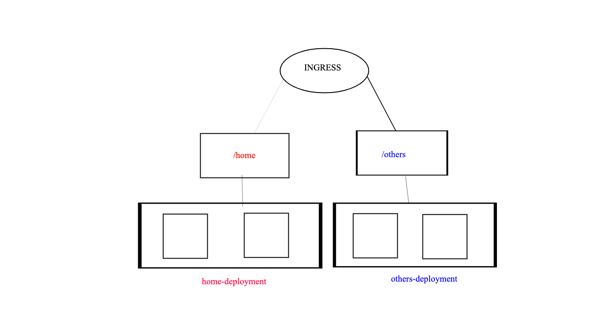

# kind-ambassador

* Create a kind Cluster
  Run the create-cluster.sh script to get one
  ```(shell)
  ➜  kind-ambassador git:(main) ✗ source create-cluster.sh 
        Creating cluster "kind-ambassador" ...
        ⢎⡀ Ensuring node image (kindest/node:v1.25.2) 🖼 
        ⢎⡱ Ensuring node image (kindest/node:v1.25.2) 🖼 
        ⠊⠁ Ensuring node image (kindest/node:v1.25.2) 🖼 
        ✓ Ensuring node image (kindest/node:v1.25.2) 🖼 
        ✓ Preparing nodes 📦  
        ✓ Writing configuration 📜 
        ✓ Starting control-plane 🕹️ 
        ✓ Installing CNI 🔌 
        ✓ Installing StorageClass 💾 
        Set kubectl context to "kind-kind-ambassador"
        You can now use your cluster with:

        kubectl cluster-info --context kind-kind-ambassador

        Have a nice day! 👋
  ```


### Deployment



## Install metallb
* exec install-metallb.sh
* `docker network inspect -f '{{.IPAM.Config}}' kind` to grep the valid ranges for the LB
